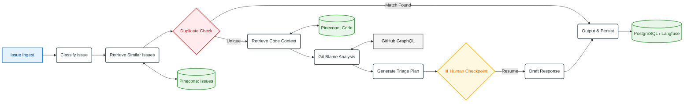

# Agentic AI Issue Automation Engine using Hybrid RAG

An enterprise-grade, stateful AI orchestration system designed to automate the lifecycle of open-source software issue triaging. Built on **LangGraph**, this production-style engine executes complex multi-step reasoning over live repository artifacts. It leverages a dual-index **Pinecone Hybrid Search** architecture (Dense + Sparse BM25) to map incoming bugs against historical contexts, track internal code dependencies via syntax-aware chunking, isolate regression authors using localized Git Blame mechanics, and maintain rigorous telemetry and evaluation safeguards.

## System Architecture

The engine operates as a stateful, event-driven directed acyclic graph (DAG) managed by LangGraph. Transitions between analytical phases are governed deterministically via state updates or conditionally by LLM edge classifiers.


## Repository Layout:
```text
github-issue-triage-agent/
├── data/
│   ├── embed.py                # Pinecone indexing and vectorization pipelines
│   └── ingest.py               # Idempotent GitHub REST/GraphQL fetching script
├── docker-compose.yml          # Container configuration for local Postgres & Redis
├── evaluation/
│   ├── baselines.py            # Reference benchmarks (Zero-shot & BM25)
│   ├── metrics.py              # Math for Precision, Recall, F1, and Accuracy
│   ├── results/                # Tracked evaluation performance metrics (CSV/JSON)
│   └── run_eval.py             # Evaluation harness execution run loops
├── notebooks/
│   └── analysis.ipynb          # Result visualization and threshold testing
├── pyproject.toml              # Project dependency and environment configurations
├── requirements.txt            # System dependencies
├── src/
│   ├── agent/
│   │   ├── graph.py            # LangGraph state machine workflow setup
│   │   ├── nodes.py            # Individual execution node logic 
│   │   ├── prompts.py          # Structured system instructions & few-shot examples
│   │   └── state.py            # TypedDict state tracking schema
│   ├── api/
│   │   ├── main.py             # FastAPI entrypoint
│   │   └── routes.py           # Webhook receiver and dashboard endpoints
│   ├── db/
│   │   ├── migrations/         # Database structural migrations
│   │   └── models.py           # SQLAlchemy metadata layout schemas
│   ├── retrieval/
│   │   ├── code_chunker.py     # Tree-sitter code-boundary parser
│   │   ├── hybrid_search.py    # Reciprocal Rank Fusion (RRF) coordinator
│   │   └── pinecone_client.py  # Pinecone index interface layer
│   └── tools/
│       ├── code_search.py      # Local regex-based search engine
│       ├── git_blame.py        # Author tracking via history logs
│       └── github_api.py       # Intermediary rate-limited API module
└── tests/
    └── test_agent.py           # Unit and integration test suites
```

## Technical Stack:
- **Orchestration:** `LangGraph` (Stateful multi-step workflows with structural checkpointing)
- **Vector DB:** `Pinecone` (Dual-index configuration optimizing semantic and syntax searches)
- **Databases:** `PostgreSQL` (Local Storage for historical triage states), `Redis` (Local caching & GitHub token rate management)
- **Observability:** `Langfuse` (Execution tracing, cost calculations, telemetry logs)
- **APIs:** `GitHub REST` + `GraphQL API` (Data ingestion, Git Blame tree construction)
